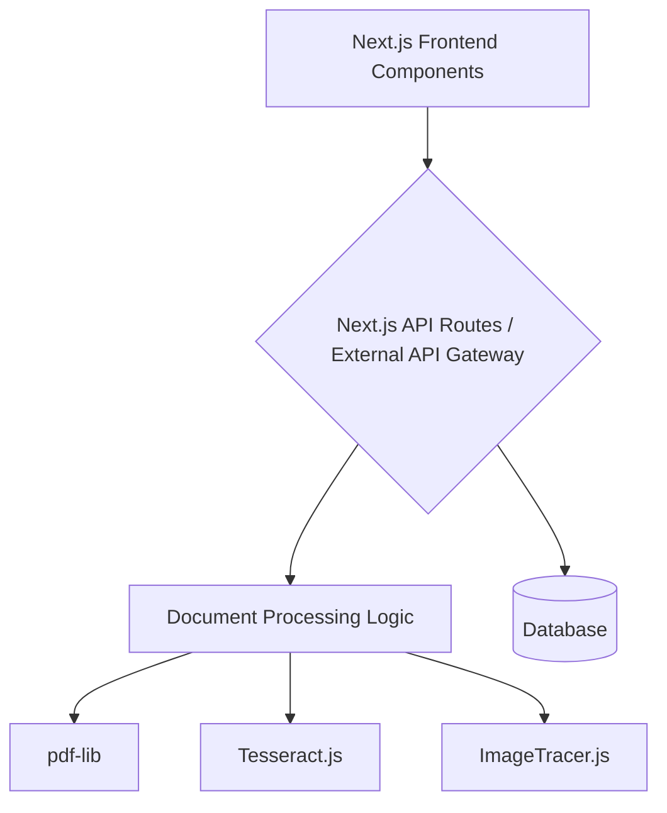

# Architecture Document

This document outlines the architecture for the web-based document processing application.

## 1. Requirements

- **Project Goal:** Develop a web-based application for document processing, including features like document editing, OCR, and image tracing.
- **User Interface:** Modern, intuitive, and responsive user interface.
- **Deployment:** Target Vercel for deployment.

*(Further details on specific functional and non-functional requirements will be added here based on discussion.)*

## 2. Technology Stack

- **Frontend Framework:** Next.js (React)
- **Programming Language:** TypeScript, JavaScript
- **Key Libraries (Client-side):**
    - `pdf-lib`: For PDF manipulation.
    - `Tesseract.js`: For Optical Character Recognition (OCR).
    - `ImageTracer.js`: For tracing bitmap images to SVG.
- **Deployment Platform:** Vercel
- **Styling:** Tailwind CSS

*(Database, backend services, authentication solutions, etc., to be determined.)*

## 3. Proposed Structure

A standard Next.js project structure will be followed, leveraging its conventions for pages, components, API routes, and public assets.

```
/
├── .next/                     # Next.js build output
├── public/
│   ├── assets/
│   │   └── images/
│   ├── file.svg
│   ├── globe.svg
│   ├── next.svg
│   ├── pdf-worker/
│   │   └── pdf.worker.min.mjs
│   ├── vercel.svg
│   └── window.svg
├── src/
│   ├── app/
│   │   ├── (main)/              # Main application routes (example grouping)
│   │   │   ├── editor/          # Document editor feature
│   │   │   └── process/         # Document processing feature
│   │   ├── api/                 # API routes (if backend logic is within Next.js)
│   │   ├── favicon.ico
│   │   ├── globals.css
│   │   ├── layout.tsx           # Root layout
│   │   └── page.tsx             # Root page (homepage)
│   ├── components/
│   │   ├── ui/                  # Reusable UI elements (buttons, inputs, etc. - Shadcn/ui style)
│   │   ├── layout/              # Layout specific components (header, footer, sidebar)
│   │   ├── home/                # Components specific to the homepage
│   │   ├── editor/              # Components specific to the editor feature
│   │   └── universal/           # Components used across multiple features
│   ├── lib/                     # Utility functions, helpers, constants
│   ├── services/                # External API integrations or complex business logic modules
│   ├── hooks/                   # Custom React hooks
│   ├── store/                   # State management (e.g., Zustand, Redux Toolkit)
│   └── types/                   # TypeScript type definitions (e.g., pdf.d.ts)
├── .gitignore
├── bun.lockb
├── eslint.config.mjs
├── netlify.toml                 # (Consider removing if solely using Vercel)
├── next.config.js
├── package.json
├── postcss.config.mjs
├── tailwind.config.ts
├── tsconfig.json
└── architecture.md              # This document
```

**Key Directory Explanations:**

-   `src/app/`: Core application using Next.js App Router. Routes are defined by folder structure.
    -   `src/app/api/`: For backend API endpoints if not using separate backend services.
-   `src/components/`: Reusable React components, organized by feature or type (UI, layout).
-   `src/lib/`: Utility functions, helper scripts, constants.
-   `src/services/`: Modules for interacting with external APIs or encapsulating complex business logic.
-   `src/hooks/`: Custom React hooks for shared component logic.
-   `src/store/`: Global state management if needed.
-   `src/types/`: TypeScript type definitions.
-   `public/`: Static assets.

*(This structure will be refined based on decisions regarding monolith vs. microservices, specific backend needs, and other architectural choices.)*

## 4. Architecture Diagrams

*(Text-based diagrams (e.g., Mermaid.js syntax or simple ASCII) will be added here to illustrate component interactions, data flow, and deployment architecture once decisions are solidified.)*

**Example (High-Level Component Diagram - Placeholder):**



## 5. Recommendations & Warnings

*(This section will include best-practice recommendations, potential trade-offs of chosen approaches, and warnings about common pitfalls related to scalability, security, maintainability, CI/CD, logging, and monitoring.)*

**Initial Considerations:**

-   **Scalability:** For CPU-intensive tasks like OCR or complex image tracing, consider if Next.js serverless functions are sufficient or if dedicated backend services (e.g., running on Node.js, Python, or Go) would be more appropriate for long-running or resource-heavy operations.
-   **State Management:** Evaluate the need for a global state management library based on the complexity of shared state between components.
-   **Error Handling & Logging:** Implement robust error handling and logging across both frontend and backend components.
-   **Security:** Pay attention to input validation, secure handling of uploaded files, and authentication/authorization mechanisms.
-   **Component Reusability:** Design components to be as reusable and decoupled as possible.
-   **Testing:** Plan for unit, integration, and potentially end-to-end tests.